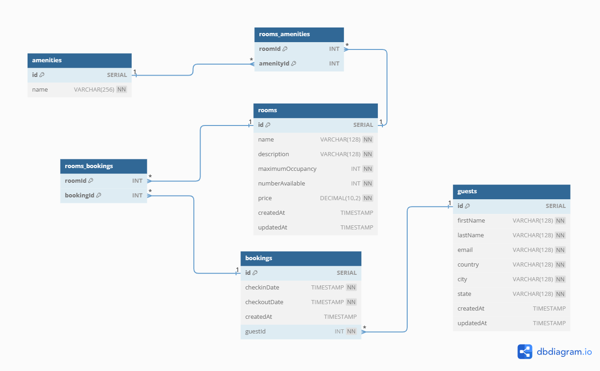

# BookARoom - A robust room booking API application

The idea behind BookARoom is to help accomodation-seeking users book rooms easily. An enterprise that seeks to use this API will be able to:

- Add new rooms for users to book
- Update amenities of each room
- Provide an interface for a user to book a room or multiple rooms, set booking date and departure date

## Entity Relationship Diagram

## Application is still under development

Full documentation will be provided on postman as soon as the first docker image is published. Please be patient.
